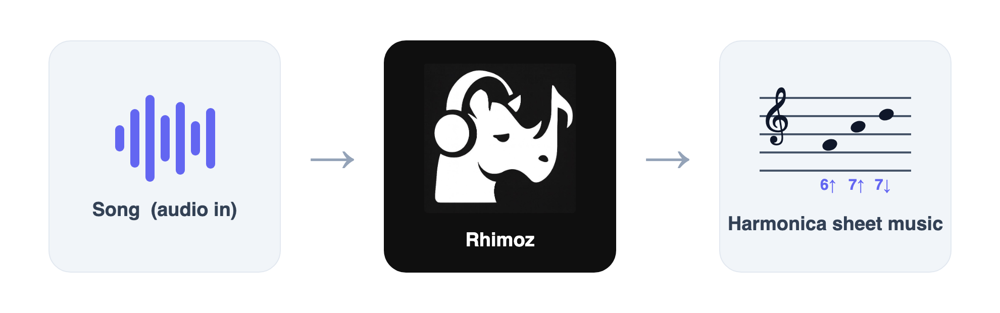

# Rhimoz

AI music transcription: audio in, downloadable sheet music out (PDF,
MusicXML, MIDI). First and currently only supported instrument is
**chromatic harmonica**.

What makes it harmonica-specific is the tab overlay: the standard notation
is rendered normally, with a second line underneath each note showing the
hole number and a blow/draw arrow (up = blow, down = draw), the format used
in published harmonica tab books. Sign in to save transcriptions and reopen
them later, and search across your own songs plus a bundled public-domain
library. You can transcribe an uploaded audio file or record straight from
your microphone.

## Dev setup

See [engine/README.md](engine/README.md), [backend/README.md](backend/README.md),
and [frontend/README.md](frontend/README.md).

## Future

Next steps, in rough priority order:

- Instrument expansion via the profile abstraction: piano, guitar, violin,
  flute.
- Mic listening: record-then-transcribe is done; still to come are
  real-time/continuous live notation and using it on a phone (needs HTTPS
  so the browser allows mic access off localhost).
- Fetching arbitrary copyrighted audio by song title, and YouTube
  ingestion.
- Training a custom pitch-detection model from scratch.
